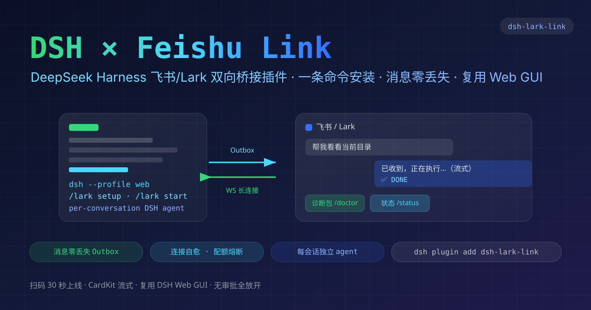

# dsh-lark-link

<p align="center">
  
</p>

**DeepSeek Harness × 飞书/Lark 双向桥接插件** — 高可靠飞书桥：扫码 30 秒上线 · 消息零丢失 · CardKit 流式 · 每飞书会话独立 DSH agent · 复用 DSH Web GUI

> 设计 spec：[`.spec/2026-08-13-2333-dsh-lark-link综合设计spec.md`](.spec/2026-08-13-2333-dsh-lark-link综合设计spec.md)

## 特性

| 能力 | 说明 |
| ---- | ---- |
| 🎯 一键认证 | `/lark setup` 扫码创建飞书应用（自动订阅消息事件 + 群聊全量 + 表情权限），30 秒上线 |
| ✍️ CardKit 流式 | schema 2.0 真流式卡片（逐字打印），关闭时先关流再定稿全量 |
| 💪 消息零丢失 | 持久 Outbox（JSONL + at-least-once + 幂等键 + 分航道 + 失败离队不阻塞），kill 重启续投 |
| 🛡 连接自愈 | probe 驱动受控重连 + QuotaGovernor 配额熔断 + 断连补偿 |
| 🔀 每会话独立 agent | 每飞书会话一个 DSH session（私聊/群隔离、并行不串线、idle 回收、映射持久化） |
| 🖥 复用 DSH Web GUI | 桥 agent = 原生 DSH session，聊天/流式/工具卡/设置全由 GUI 呈现；client 只加状态浮层 |
| 🔘 一键按钮卡片 | 欢迎卡/命令面板/状态卡带 schema 2.0 平铺按钮（behaviors callback 回传，无 tag:action——对齐飞书 200861 修复） |
| 🔀 原生命令转发 | 三级分流：桥特有命令桥处理；DSH 已注册命令原生调 handler；`/goal`、未知 `/xxx`、普通消息原样注入 agent（无拦截无门禁）；skill 无前缀——直接描述任务，模型自动加载 |
| 🔓 无审批全放开 | 用户决策：所有工具调用默认直接放行，无审批卡、无询问 |
| 📎 出站多媒体 | 模型经 `lark_send_local_file` 工具主动回传本地图片/文件到当前飞书会话（路径白名单 + 大小校验） |
| 🩺 一键诊断 | 飞书 `/doctor`（`/support` 旧名兼容）→ 脱敏诊断包回发 |

## 快速开始

**标准方式（官方 `dsh plugin` 机制，无侵入）**——包以官方 bundle 格式分发：`package.json` 声明 `dsh.bundle`，安装后 `dsh` 自动把它并入 profile 的 `dsh.profile.bundles` 层，不改任何全局配置、不写 profile 之外的文件：

```bash
# npm 发布后（推荐，装的是预构建产物，无需任何构建许可）：
dsh plugin add dsh-lark-link --ignore-scripts

# 或直接装 tarball：
dsh plugin add ./dsh-lark-link-0.1.0.tgz --ignore-scripts

# 或从 GitHub（源码安装，需 prepare 构建 + allowBuilds 许可，见官方 publish.md）：
dsh plugin add github:<owner>/dsh-lark-link
```

> `--ignore-scripts`：飞书官方 SDK（@larksuiteoapi/node-sdk）的传递依赖 protobufjs 带一个可忽略的 postinstall（仅生成 banner），pnpm 11 安全策略会拦截它并返回非零退出码。加此参数即跳过（protobufjs 不执行 postinstall 完全可用）。在真实用户机上 pnpm 可能已全局放行，则可不加。

```bash
dsh --profile web     # 启动 DSH Web GUI（插件随宿主生命周期加载）
/lark setup           # 终端或 GUI 面板扫码 → 凭据写入 ctx.credentials
/lark start           # 启动桥接
```

卸载同样干净（官方机制）：`dsh plugin remove dsh-lark-link` 同时移除依赖与 bundle 层。

然后在飞书搜索你的机器人发消息——收到回复即端到端连通。

### 开发者

```bash
npm run dev:link   # 链接本地 DSH checkout（类型检查/测试需要；DSH_REPO=/path 指定位置）
npm run check      # tsc --noEmit
npm test           # 93 项单元 + 集成测试
npm run build      # tsdown → dist/（宿主 ESM + client ModuleLoader 包）
npm pack           # 产出可分发 tarball
```

## 命令

### DSH 侧（CLI / GUI composer）

```
/lark setup            扫码建应用（终端出二维码；addons 自动订阅消息事件 + 群聊全量 + 表情权限）
                       手动通道：设 DSH_LARK_APP_ID + DSH_LARK_APP_SECRET（可选 DSH_LARK_DOMAIN=lark）后再跑
/lark start            启动桥接（未配置凭据会提示先 /lark setup，不会崩溃）
/lark stop             停止（不断凭据/配置）
/lark restart          重启
/lark status           全链路健康视图
/lark uninstall-clean  清除凭据 + 清空状态目录（不可逆；配置/凭据一并清除）
```

> 凭据只进 `ctx.credentials`（ref `LARK_LINK_APP`，存为 JSON blob `{appId,appSecret,domain}`）；`config.json` 只存 ref，不含密钥。

### 飞书侧（三级分流）

**无拦截、无门禁**——每一条 `/` 消息要么被桥处理/适配，要么原样交给 DSH，绝不静默丢弃：

| 类别 | 命令 | 行为 |
| ---- | ---- | ---- |
| 桥特有 | `/status` `/workspace` `/stop` `/doctor`（`/support` 兼容）`/sessions` `/lark-config` `/help` | 桥处理（状态/工作区/中断/诊断/会话列表/热改） |
| DSH 注册命令 | `/lark-*` 及其他已注册命令 | **原生调 handler**，结果回飞书（不经模型） |
| 原样注入 | `/goal`、模板、未知 `/xxx`、普通消息 | **原样注入**对应 DSH agent，输出经事件流逐条回飞书 |

> 命令没有前缀白名单：插件命令（如 `/goal`）、模板、任何未知 `/xxx` 都原样透传——由 DSH 侧按其原生语义执行，输出流式回投本会话。skill 无前缀：DSH 的 skill 是模型工具（`skill` tool），直接描述任务即可，模型会自动加载对应 skill。

### 多媒体

- **出站**：模型在对话中可直接调用 `lark_send_local_file` 工具，把本地图片/文件上传并发到当前飞书会话（路径限制在工作区内）。
- **入站**：图片/文件消息当前以文本占位形式进入会话（M6 待实现：图片→视觉模型、文件→有界文本提取）。

## 状态目录

`<DSH_HOME>/lark-link/`（`DSH_LARK_LINK_HOME` 可覆盖）：

```
config.json / runtime-overrides.json   桥配置 + 热改（凭据不在其中）
routes.json                            会话路由（30d）
dedupe.jsonl                           入站去重
conn-history.jsonl                     配额熔断历史
outbox/seg-*.jsonl + blobs/            持久出站队列
status.json                            连接状态
```

## 开发

```bash
npm run check   # tsc --noEmit
npm test        # 90 项单元 + 集成测试（node:test，零额外 dev 依赖）
```

测试覆盖：normalizeInbound v2.0 结构矩阵、supervisor 静默/熔断、quota 跨重启、
outbox 崩溃恢复/分航道/幂等/blob spill、CardKit 关流序列、命令三级分流、
权限全放开矩阵、端到端桥回路（飞书消息→agent→持久投递）、插件装配冒烟。

## 致谢

架构与关键机制深度借鉴 [pi-feishu-link](https://github.com/amlyczz/pi-feishu-link)
（Outbox/受控重连/熔断/断连补偿/表情回执/三级分流/诊断）与三参考项目
[pi-lark-notify](https://github.com/Naoki326/pi-lark-notify)、
[pi-feishu-lark](https://github.com/yangtuooc/pi-feishu-lark)、
[pi-remote-feishu](https://github.com/grin-coder/pi-remote-feishu)
（CardKit 流式 / per-key 队列 / 会话映射 / 权限桥思想）。

## License

MIT
